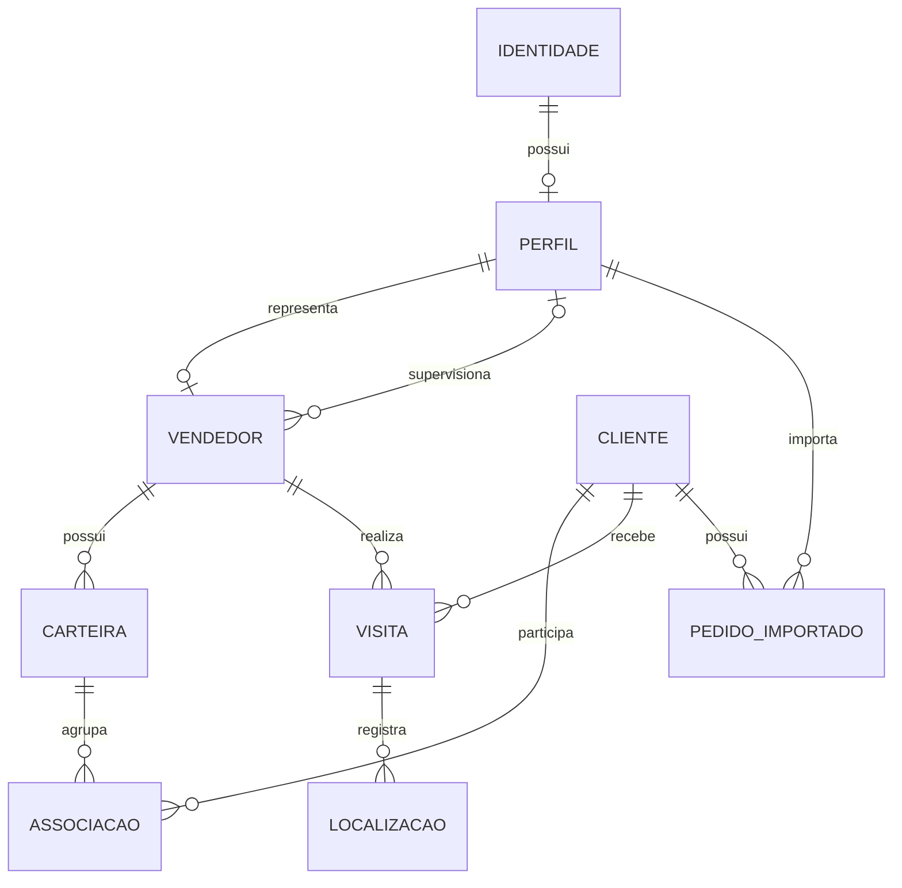

# MER — Modelo Entidade-Relacionamento

> Análise documental em 21/09/2026. Esquema reconstruído dos 13 scripts locais da origem; não é uma inspeção do banco remoto nem comprova que as migrations foram aplicadas. Nenhum SQL foi executado no Supabase.

## Contexto e entidades

O sistema centraliza visitas comerciais. Um usuário autenticado tem um perfil de acesso; um perfil pode estar associado a um vendedor. Vendedores possuem carteiras, que agrupam clientes. Cada visita relaciona um cliente a um vendedor e pode registrar eventos de localização.

| Entidade conceitual | Tabela | Identidade e responsabilidade |
| --- | --- | --- |
| Identidade autenticada | `auth.users` | Usuário gerenciado pelo Supabase Auth |
| Perfil | `profiles` | Nome, papel e situação do usuário |
| Vendedor | `sellers` | Dados operacionais e vínculo opcional com gestor |
| Cliente | `clients` | Cadastro, endereço, contato e coordenadas |
| Carteira | `portfolios` | Agrupamento de clientes pertencente a um vendedor |
| Associação de carteira | `portfolio_clients` | Relação entre cliente e carteira, com data de atribuição |
| Visita | `visits` | Agenda, início, conclusão, resultado e observações |
| Evento de localização | `visit_locations` | Coordenadas e precisão em um evento de visita |
| Pedido importado (extensão) | `sales_orders` | Registro comercial proveniente do ERP |

## Diagrama conceitual

Legenda: `||` = exatamente um; `o|` = zero ou um; `o{` = zero ou muitos. O MER usa as cardinalidades permitidas pelo esquema existente, inclusive quando a interface é mais restritiva.

## Cardinalidades e regras

1. Cada perfil referencia exatamente uma identidade. A chave estrangeira não obriga toda identidade a ter perfil; o trigger de criação procura garantir esse cadastro operacionalmente.
2. Cada vendedor referencia um perfil único. Um perfil pode não possuir vendedor ou possuir um, inclusive um registro desativado após mudança de papel.
3. Um vendedor pode apontar para zero ou um perfil gestor. Um perfil pode ser referenciado por vários vendedores. A FK não exige `role = manager` no perfil apontado.
4. Cada carteira pertence a um vendedor; um vendedor pode ter várias carteiras.
5. Cliente e carteira formam relação N:N. A chave composta impede repetir o mesmo par, mas não impede um cliente em várias carteiras. Não foi identificada unicidade global de `client_id` nessa associação.
6. Cada visita pertence a exatamente um cliente e um vendedor. As FKs não comprovam que esse cliente está na carteira do vendedor.
7. Uma visita pode não ter localização ou ter vários eventos. Não há unicidade de `(visit_id, event_type)`.
8. Um pedido importado pertence a um cliente e possui um perfil importador. Não há tabela de itens de pedido nessa modelagem.

## Regras de negócio identificadas

| Regra | Evidência | Limite |
| --- | --- | --- |
| Papéis administrador, gestor e vendedor | CHECK de `profiles.role` | O controle de atribuição do papel exige revisão de segurança |
| Estados agendada, iniciada, confirmada e cancelada | CHECK de `visits.status` | O banco permite os valores, mas não implementa a máquina de estados |
| Cadastro de cliente pelo vendedor vincula carteira | Trigger da migration `202608260002` | Cria carteira ativa caso necessário; concorrência precisa de teste |
| Administração direta das carteiras só pelo administrador | Políticas substituídas em `202608240001` | O trigger de cadastro é exceção controlada à escrita direta |
| Cancelamento preserva o registro | Aplicação atualiza `status = cancelled` | Não é exclusão física |
| Pedido não pode repetir a chave de importação | UNIQUE de `sales_orders.import_key` | A qualidade da chave depende do importador |

## Recorte acadêmico

Priorizar identidade, perfil, vendedor, cliente, carteira e visita na solução inicial. A localização pode ser incorporada conforme a validação em campo. Pedidos do ERP permanecem documentados como capacidade da origem, sem inclusão automática no escopo da primeira migração.

Fonte: migrations inventariadas em [rastreabilidade](06_VALIDACAO.md); as regras de interface foram conferidas em `lib/data/supabase_repository.dart` da origem.
