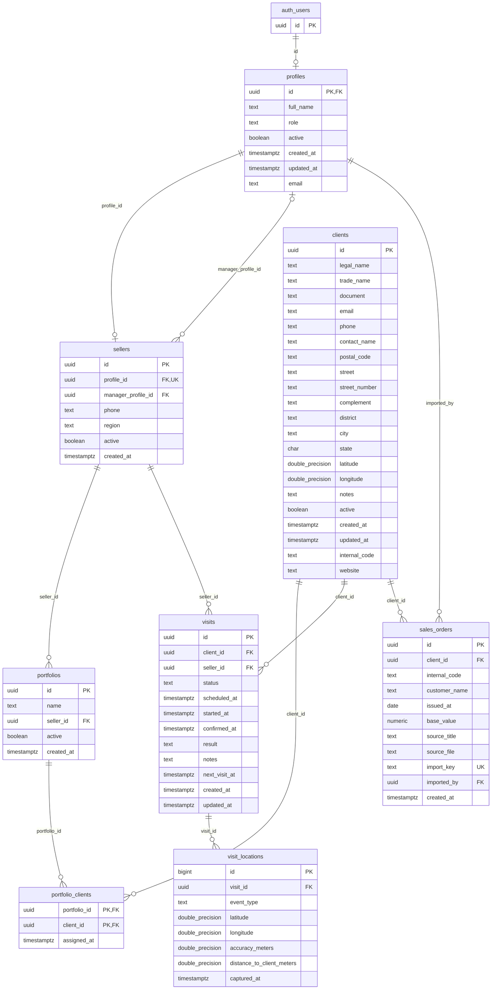

# DER — Modelo lógico e físico

> Análise documental em 21/09/2026. Esquema reconstruído dos 13 scripts locais da origem; não é uma inspeção do banco remoto nem comprova que as migrations foram aplicadas. Nenhum SQL foi executado no Supabase.

O diagrama representa as oito tabelas da aplicação após as alterações dos scripts analisados. `auth_users` é o rótulo gráfico de `auth.users`. Tipos abreviados no desenho têm precisão e regras detalhadas no [dicionário](03_DICIONARIO.md).

## Chaves e exclusão referencial

| Referência | Obrigatória | Ao excluir o registro pai |
| --- | --- | --- |
| `profiles.id → auth.users.id` | Sim; PK e FK | CASCADE |
| `sellers.profile_id → profiles.id` | Sim; UNIQUE | RESTRICT |
| `sellers.manager_profile_id → profiles.id` | Não | SET NULL |
| `portfolios.seller_id → sellers.id` | Sim | RESTRICT |
| `portfolio_clients.portfolio_id → portfolios.id` | Sim | CASCADE |
| `portfolio_clients.client_id → clients.id` | Sim | CASCADE |
| `visits.client_id → clients.id` | Sim | RESTRICT |
| `visits.seller_id → sellers.id` | Sim | RESTRICT |
| `visit_locations.visit_id → visits.id` | Sim | CASCADE |
| `sales_orders.client_id → clients.id` | Sim | RESTRICT |
| `sales_orders.imported_by → profiles.id` | Sim | NO ACTION, padrão do PostgreSQL |

Consequência: o CASCADE entre Auth e perfil pode ser impedido por referências a vendedor ou pedido. Desativar e excluir são operações distintas. O modelo não contém cascade de cliente para visitas ou pedidos.

## Índices explícitos

| Índice | Colunas/expressão | Finalidade e observação |
| --- | --- | --- |
| `sellers_profile_id_idx` | `sellers(profile_id)` | Busca por perfil; possivelmente redundante com UNIQUE |
| `portfolios_seller_id_idx` | `portfolios(seller_id)` | Carteiras do vendedor |
| `portfolio_clients_client_id_idx` | `portfolio_clients(client_id)` | Associação pelo cliente |
| `visits_client_id_idx` | `visits(client_id)` | Histórico por cliente |
| `visits_seller_id_confirmed_at_idx` | `visits(seller_id, confirmed_at DESC)` | Histórico de confirmações |
| `clients_city_idx` | `clients(city)` | Filtro por cidade |
| `visits_seller_scheduled_at_idx` | `visits(seller_id, scheduled_at) WHERE status = 'scheduled'` | Agenda do vendedor |
| `visits_client_scheduled_at_idx` | `visits(client_id, scheduled_at) WHERE status = 'scheduled'` | Agenda do cliente |
| `clients_internal_code_unique_idx` | `lower(trim(internal_code))`, somente não nulos e não vazios | Unicidade normalizada do código ERP |
| `sales_orders_client_issued_at_idx` | `sales_orders(client_id, issued_at DESC)` | Pedidos do cliente |
| `sales_orders_issued_at_idx` | `sales_orders(issued_at DESC)` | Período de emissão |
| `sales_orders_internal_code_idx` | `sales_orders(internal_code)` | Código ERP importado |

PKs e restrições UNIQUE também criam índices. O índice único parcial do código ERP não é uma restrição de unicidade para valores nulos ou vazios. Nenhum índice geográfico ou extensão PostGIS é criado nesses scripts.

Não foi encontrado índice explícito sobre `visit_locations.visit_id`. Avaliar sua criação com consultas representativas e plano de execução; nenhuma medição de desempenho foi realizada nesta entrega.
