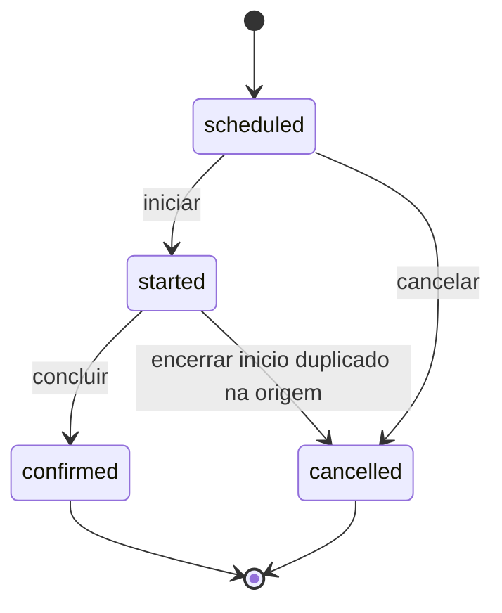

# Análise de integridade, normalização e evolução

> Análise documental em 21/09/2026. Esquema reconstruído dos 13 scripts locais da origem; não é uma inspeção do banco remoto nem comprova que as migrations foram aplicadas. Nenhum SQL foi executado no Supabase.

## Normalização

| Aspecto | Leitura do esquema | Avaliação |
| --- | --- | --- |
| Primeira forma normal | Campos escalares; associação de carteiras em tabela própria | Não há listas repetidas de clientes dentro da carteira |
| Segunda forma normal | PK simples nas entidades; chave composta na associação | `assigned_at` descreve o par carteira-cliente, sem dependência parcial identificada |
| Terceira forma normal | Perfis, vendedores, clientes e visitas separados | Há boa separação de responsabilidades, mas não se comprova 3FN global sem confirmar dependências do negócio |
| Endereço e contato | Um conjunto de campos em `clients` | Adequado ao recorte de um contato/endereço; múltiplos exigirão novas entidades |
| E-mail do perfil | Cópia de `auth.users.email` | Redundância entre subsistemas; não há trigger de sincronização de alteração de e-mail nos scripts lidos |
| Pedido importado | `internal_code` e `customer_name` junto à FK do cliente | Pode ser snapshot histórico legítimo; definir que os campos preservam o conteúdo importado |

Não se assume dependência universal entre CEP, rua, cidade e UF. Uma normalização adicional deve partir das regras reais do cadastro e do uso pretendido.

## Integridade e ciclo de vida

- As FKs impedem referências inexistentes e preservam visitas/pedidos contra remoções dos pais.
- As CHECKs validam papéis, estados, tipos de evento, faixas das coordenadas de visita e valor-base não negativo.
- `clients.latitude/longitude` não possuem as mesmas CHECKs das localizações de visita.
- `accuracy_meters` e `distance_to_client_meters` aceitam negativos e nulos no esquema; propor validação quando informados.
- Datas de início e confirmação podem ser incoerentes com o estado ou entre si. Não há CHECK temporal.
- Não existe unicidade de cliente por carteira global, de visita em andamento por par vendedor-cliente ou de evento por tipo.
- `active` existe em perfis, vendedores, clientes e carteiras, mas a filtragem não é uniforme em todas as políticas.
- Datas de atualização não constituem uma trilha de auditoria: não registram autor, valores anteriores nem motivo.

Fluxo de negócio esperado para discussão, não máquina de estados imposta pelo SQL:

A origem também pode registrar atendimento sem agendamento prévio. Formalizar quais caminhos serão aceitos no Movisitas antes de adicionar restrições.

## Achados de revisão e propostas

Os pontos abaixo foram identificados por leitura estática; não são resultados de testes contra o ambiente remoto. Nenhuma correção foi aplicada nesta entrega.

| ID | Prioridade | Evidência e impacto | Ação proposta |
| --- | --- | --- | --- |
| BD-01 | Alta | `handle_new_user` aceita papel vindo de `raw_user_meta_data`; com cadastro público permitido, um papel privilegiado pode ser solicitado pelo cliente | Criar perfil com papel seguro e atribuir privilégios por fluxo administrativo confiável; conferir configuração do Auth |
| BD-02 | Alta | `manage_user_profile` usa `IF caller_role NOT IN (...)`; com NULL o teste não entra no bloqueio | Rejeitar explicitamente NULL e testar chamada autenticada sem perfil ativo; validar entradas nulas também |
| BD-03 | Alta | `current_seller_id` verifica vendedor ativo, mas não verifica perfil ativo | Unificar a verificação de atividade e testar sessão existente após desativação |
| BD-04 | Alta | Política de INSERT/UPDATE de visitas verifica vendedor, mas não vínculo do cliente com sua carteira | Validar carteira no banco; testar envio direto de UUID de cliente alheio |
| BD-05 | Média | `can_manage` confere acesso global a gestores; `manager_profile_id` não restringe a equipe nas políticas lidas | Decidir se o gestor vê toda a operação ou somente sua equipe |
| BD-06 | Média | Carteira-cliente é N:N; a aplicação remove vínculos e reinsere em chamadas distintas | Confirmar exclusividade de carteira e considerar operação transacional para transferência |
| BD-07 | Média | `profiles.active` e `sellers.active` podem divergir; trigger sincroniza mudança de papel, não toda alteração de atividade | Definir a fonte de verdade e sincronização de desativação |
| BD-08 | Média | Nenhum índice explícito para `visit_locations.visit_id`; índice de perfil do vendedor possivelmente redundante | Medir consultas com dados fictícios e revisar índices |
| BD-09 | Média | `update-user/index.ts` usa `newPassword.isNotEmpty`, propriedade ausente em strings JavaScript/TypeScript | Corrigir antes da migração e testar redefinição de senha; não afirmar que esse fluxo está validado |
| BD-10 | Média | Escrita do perfil e alteração de Auth ocorrem em serviços/chamadas separados | Prever falha parcial, compensação e nova tentativa idempotente |
| BD-11 | Média | Bootstrap do administrador depende de um e-mail específico da origem | Substituir por procedimento de provisionamento do destino; não copiar a identificação pessoal para a entrega |
| BD-12 | Média | Trigger de cliente escolhe/cria carteira sem garantia de unicidade por vendedor | Testar cadastros concorrentes; decidir regra para múltiplas carteiras |

## Capacidade, retenção e recuperação

Não foram medidos volumes ou latências. As estimativas devem considerar clientes, visitas por dia e eventos de localização por visita. Validar filtros e paginação com volume representativo; usar planos de execução antes de criar índices adicionais.

Definir responsáveis, prazo de retenção e acesso às coordenadas, contatos e observações. Usar dados fictícios em testes e evidências públicas. Definir backup e recuperação conforme os recursos efetivos do ambiente; nenhuma política de backup ou restauração foi validada nesta análise.

## Decisões pendentes

1. Um cliente pode pertencer a mais de uma carteira?
2. Gestores consultam toda a empresa ou apenas vendedores supervisionados?
3. A geolocalização é opcional em todas as confirmações?
4. Qual histórico precisa permanecer após desativação ou transferência?
5. Haverá um banco acadêmico separado do banco operacional?

Estas decisões podem ser discutidas na próxima etapa; não impedem a documentação do modelo existente.
