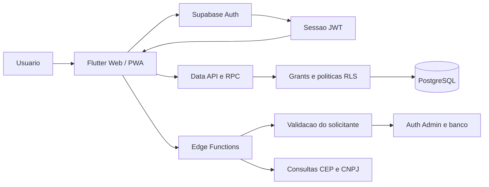

# Supabase — arquitetura, acesso e operação

> Análise documental em 21/09/2026. Esquema reconstruído dos 13 scripts locais da origem; não é uma inspeção do banco remoto nem comprova que as migrations foram aplicadas. Nenhum SQL foi executado no Supabase.

## Papel na solução

O Supabase fornece PostgreSQL, autenticação e APIs utilizadas pelo projeto de origem. O Flutter utiliza o SDK `supabase_flutter`; o projeto contém três Edge Functions para operações de usuários e consultas cadastrais. A existência desses arquivos não comprova sua publicação.

O caminho administrativo deve validar o solicitante antes de usar credenciais privilegiadas. `lookup-customer` não apresenta validação explícita de usuário no corpo da função lida; a configuração de autenticação na publicação deve ser conferida.

## Identidade e autorização

`auth.users` mantém a identidade; `profiles` guarda nome, papel e atividade da aplicação. O trigger `handle_new_user` cria o perfil. A recomendação oficial é vincular tabelas da aplicação à chave primária de Auth e proteger esses dados com RLS. [Supabase: User Management](https://supabase.com/docs/guides/auth/managing-user-data).

A função `current_app_role()` retorna o papel do perfil ativo. `current_seller_id()` encontra o vendedor ativo associado à identidade. `can_manage()` aceita administrador ou gestor. As diferenças de atividade e a confiança em metadados estão registradas em [achados BD-01 a BD-07](04_ANALISE.md).

Grants autorizam a operação na tabela; RLS restringe as linhas alcançadas. Uma política permissiva adicional pode ampliar o acesso, por isso a leitura precisa considerar o conjunto final das políticas. [Supabase: Row Level Security](https://supabase.com/docs/guides/database/postgres/row-level-security).

## Matriz de acesso reconstruída

Matriz para acesso direto via API com usuário autenticado, baseada nos grants explícitos e nas políticas dos scripts. Não inclui concessões adicionais ou alterações manuais do projeto remoto. Funções privilegiadas têm regras próprias.

| Objeto | Administrador | Gestor | Vendedor |
| --- | --- | --- | --- |
| Perfis | Lê todos; atualiza diretamente | Lê todos; alteração de vendedor via RPC | Lê próprio perfil |
| Vendedores | Lê, insere e atualiza | Lê, insere e atualiza | Lê registro vinculado à própria identidade |
| Clientes | Lê, insere e atualiza | Lê, insere e atualiza | Lê/atualiza clientes de carteira ativa; insere com trigger de associação |
| Carteiras | Lê, insere e atualiza | Lê todas | Lê próprias |
| Associação carteira-cliente | Lê, insere, atualiza e exclui | Lê todas | Lê vínculos das próprias carteiras |
| Visitas | Lê, insere e atualiza | Lê, insere e atualiza | Lê/insere/atualiza visitas com seu vendedor |
| Localizações | Lê e insere quando alcança a visita | Lê e insere quando alcança a visita | Lê e insere quando alcança a própria visita |
| Pedidos ERP | Lê e insere com importador igual à identidade atual | Não recebe permissão global pela função `can_manage` | Lê pedidos de clientes de carteira ativa |

Pedidos também podem ser lidos por qualquer identidade que possua o vínculo de vendedor ativo exigido pela política; não há teste literal de `role = seller` nesse ramo. UPDATE e DELETE de pedidos não são concedidos nos scripts.

Não há política de DELETE para visitas, clientes ou localizações. Para vendedores e carteiras existem políticas `FOR ALL`, mas não há GRANT DELETE explícito nesses scripts; conferir grants herdados/defaults antes de concluir o comportamento efetivo. O cancelamento de visita na aplicação é UPDATE de status.

## Funções e gatilhos

| Função SQL | Responsabilidade | Observação |
| --- | --- | --- |
| `set_updated_at` | Atualiza data em perfis, clientes e visitas | BEFORE UPDATE |
| `handle_new_user` | Cria perfil após cadastro no Auth | SECURITY DEFINER; atribuição de papel exige revisão |
| `sync_seller_from_profile` | Cria/reativa vendedor ao assumir papel seller; desativa ao sair | AFTER INSERT ou UPDATE de role |
| `current_app_role` | Consulta papel do perfil ativo | Auxiliar de RLS |
| `current_seller_id` | Consulta vendedor ativo | Não confere atividade do perfil |
| `can_manage` | Verifica administrador ou gestor | Abrangência global nos scripts |
| `manage_user_profile` | Altera perfil e dados do vendedor | RPC autenticada, com revisão de validação NULL pendente |
| `assign_new_client_to_current_seller` | Cria/seleciona carteira e associa novo cliente | AFTER INSERT; função privilegiada com search_path public |

| Edge Function | Fluxo observado |
| --- | --- |
| `create-user` | Valida sessão/papel; administrador cria papéis admitidos e gestor cria vendedor; usa Auth Admin |
| `update-user` | Valida solicitante, chama RPC e atualiza Auth; verificar problema da redefinição de senha e falhas parciais |
| `lookup-customer` | Consulta CEP e CNPJ em serviços externos; conferir autenticação e limites no ambiente |

## Configuração de cliente e servidor

O código da origem recebe `SUPABASE_URL` e `SUPABASE_ANON_KEY` por configuração de build. Apesar do nome legado da segunda variável, a documentação local prevê uma chave publicável. Sem configuração, a origem oferece modo demonstrativo em memória; isso ainda não está implementado no repositório Movisitas.

Chaves publicáveis identificam a aplicação e podem integrar o frontend. Credenciais secretas e `service_role` são exclusivas do servidor e podem contornar RLS. A sessão JWT identifica o usuário separadamente da chave da aplicação. [Supabase: API keys](https://supabase.com/docs/guides/getting-started/api-keys).

Não é necessário copiar credenciais ou dados reais para produzir os diagramas. Storage, Realtime e buckets não são configurados pelas migrations analisadas; não serão apresentados como recursos implantados.

## Evolução e ambientes

As alterações de esquema devem ser registradas em migrations e conferidas com o histórico do ambiente antes da aplicação. O versionamento dos arquivos não garante sincronismo com mudanças feitas manualmente no painel. [Supabase: Database Migrations](https://supabase.com/docs/guides/deployment/database-migrations).

Para o destino, definir ambiente acadêmico, revisar as dependências e o bootstrap administrativo, validar com dados fictícios, conferir políticas e só então aplicar mudanças aprovadas. Nenhuma configuração, publicação ou mudança no banco foi feita nesta entrega.

Referências oficiais consultadas em 21/09/2026. As descrições específicas do Movisitas vêm dos arquivos listados no manifesto, não dos exemplos genéricos da documentação do Supabase.
