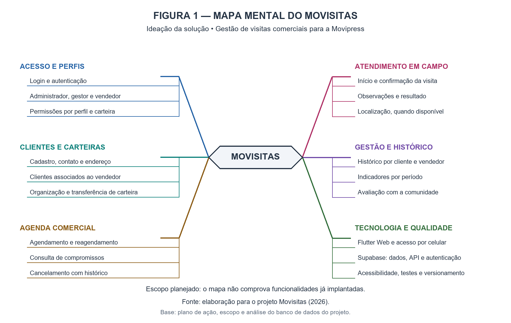

# Mapa mental — ideação do Movisitas

## Objetivo

Organizar visualmente as ideias que orientam a solução de gestão de visitas comerciais para a Movipress. A figura foi preparada em 30/09/2026 a partir do plano de ação, do escopo e da análise do banco já documentados no repositório.

O exemplo fornecido foi usado como referência de organização visual. O conteúdo deste mapa é específico do Movisitas. Esta entrega é complementar à documentação das fases 1 e 2 e não altera a numeração da fase 3, destinada à fundação da aplicação.

## Figura 1 — Mapa mental do Movisitas

Fonte: elaboração para o projeto Movisitas (2026).

O mapa representa o escopo planejado; não comprova implantação, teste de funcionalidades ou validação pela comunidade externa.

## Descrição textual acessível

| Eixo | Ideias relacionadas | Relação com o projeto |
| --- | --- | --- |
| Acesso e perfis | Login, administrador, gestor, vendedor e permissões | Identificar o usuário e limitar o acesso aos dados |
| Clientes e carteiras | Cadastro, contatos, endereços, associação e transferência | Organizar os clientes e os responsáveis pelo atendimento |
| Agenda comercial | Agendar, reagendar, consultar e cancelar | Planejar os compromissos e preservar o histórico |
| Atendimento em campo | Início, confirmação, observações, resultado e localização | Registrar o atendimento; tratar a indisponibilidade de GPS |
| Gestão e histórico | Histórico, indicadores e avaliação com a comunidade | Acompanhar a operação e orientar melhorias |
| Tecnologia e qualidade | Flutter Web, Supabase, API, acessibilidade, testes e Git | Sustentar a implementação e a validação da solução |

## Texto de apoio para a etapa de ideação

Para organizar as possibilidades da solução, foi elaborado um mapa mental com o Movisitas como elemento central. As ideias foram distribuídas em seis eixos: acesso e perfis, clientes e carteiras, agenda comercial, atendimento em campo, gestão e histórico, tecnologia e qualidade. Essa organização explicita a relação entre o planejamento das visitas, o registro dos atendimentos e o acompanhamento gerencial, servindo de referência para a priorização do protótipo.

O grupo deverá revisar o mapa e registrar o retorno da comunidade externa antes de apresentar as propostas como requisitos validados. O texto acima descreve a elaboração desta figura; não representa uma entrevista, reunião ou teste realizado.

## Relação com a modelagem do banco

- Acesso e perfis: `auth.users`, `profiles` e `sellers`.
- Clientes e carteiras: `clients`, `portfolios` e `portfolio_clients`.
- Agenda e atendimento: `visits` e `visit_locations`.
- Gestão: consultas sobre as entidades anteriores; o mapa não propõe uma nova tabela de indicadores.
- Pedidos ERP: extensão da origem, fora do recorte desta figura e da primeira entrega funcional.

O mapa mental apresenta ideias e áreas do produto. Os detalhes de chaves, cardinalidades e restrições permanecem no [MER](../Banco_de_Dados/01_MER.md) e no [DER](../Banco_de_Dados/02_DER.md). Regras ainda pendentes, como múltiplas carteiras por cliente e abrangência de acesso do gestor, estão na [análise de integridade](../Banco_de_Dados/04_ANALISE.md).

## Arquivos e atualização

- [PNG em alta resolução](mapa-mental-movisitas.png): inclusão no relatório e visualização no GitHub.
- [SVG vetorial](mapa-mental-movisitas.svg): ampliação e edição sem perda de nitidez.
- [Fonte Mermaid](mapa-mental-movisitas.mmd): estrutura textual editável do mapa. A disposição automática pode diferir da figura diagramada.

Ao modificar o escopo, atualizar os três formatos e a descrição textual. Não acrescentar uma funcionalidade como concluída sem evidência da implementação e validação correspondente.

## Referências do projeto

- [Plano de ação do Grupo 17](../Plano_de_acao-PJI240-DRP11-A2026S2-Grupo_17.pdf)
- [Escopo e arquitetura](../ESCOPO_E_ARQUITETURA.md)
- [Plano de migração](../PLANO_DE_MIGRACAO.md)
- [Documentação do banco](../Banco_de_Dados/README.md)
