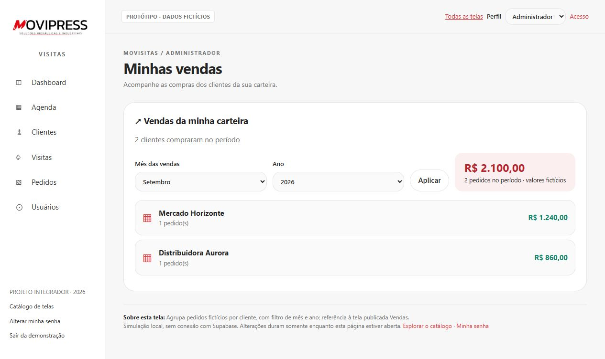

# Galeria das telas — Movisitas

24 telas e fluxos com dados exclusivamente fictícios. Capturas do protótipo local, não do ambiente de produção. [Instruções](README.md).

## T00 — Catálogo de telas

Navegação e índice das telas; proposta de apresentação acadêmica.

## T01 — Minhas vendas

Agrupa pedidos fictícios por cliente, com filtro de mês e ano; referência à tela publicada Vendas.

## T02 — Acesso ao Movisitas

Representa login por e-mail e senha; o perfil é escolhido apenas para simular a experiência.

## T03 — Recuperar acesso

Simula solicitação de recuperação; nenhum e-mail é enviado. Proposta, não identificada no login da origem.

## T04 — Dashboard

Consulta indicadores por período e vendedor, com acesso aos relatórios.

## T05 — Meu dia

Reúne progresso diário, agenda e pendências do vendedor.

## T06 — Agenda de visitas

Filtra compromissos e permite agendar, reagendar, iniciar ou cancelar.

## T07 — Agendar visita

Cria ou altera um agendamento com cliente, vendedor, data, hora e observações.

## T08 — Clientes

Consulta por nome, cidade e cobertura de atendimento; dá acesso ao cadastro e às ações.

## T09 — Detalhes do cliente

Consolida cadastro, visitas e acesso aos pedidos; composição proposta a partir de ações da origem.

## T10 — Cadastro de cliente

Inclui ou edita dados cadastrais, contato, endereço, código ERP e site; simula consultas CEP/CNPJ.

## T11 — Carteiras comerciais

Representa agrupamento e transferência administrativa; tela dedicada proposta para ações presentes na origem.

## T12 — Transferir cliente

Simula a transferência para outra carteira, exclusiva do administrador.

## T13 — Equipe comercial

Apresentação dedicada de vendedores e suas carteiras; proposta baseada nos dados da origem.

## T14 — Visitas

Consulta estados, responsáveis, datas e observações dos atendimentos.

## T15 — Iniciar atendimento

Simula início da visita, horário e localização opcional.

## T16 — Concluir atendimento

Exige observações, permite resultado e próxima ação, e encerra a visita simulada.

## T17 — Localização e rota

Esquema ilustrativo do endereço e roteiro textual; não consulta GPS ou serviço de mapas.

## T18 — Pedidos e vendas

Consulta pedidos por cliente e período; extensão da origem, fora do núcleo inicial de visitas.

## T19 — Importar pedidos

Demonstra prévia, duplicidades e confirmação com lote fictício; não processa arquivos reais.

## T20 — Usuários e permissões

Lista perfis e simula cadastro, edição e ativação de usuários.

## T21 — Cadastro de usuário

Simula cadastro e edição por administrador; gestor pode editar apenas vendedores.

## T22 — Alterar minha senha

Simula validação da senha atual e confirmação da nova senha, sem armazená-las.

## T23 — Relatório comercial

Filtra dados fictícios e permite imprimir o relatório ou exportar um HTML local.

## Experiência móvel

Agenda no perfil vendedor, 390 × 844 pixels.

