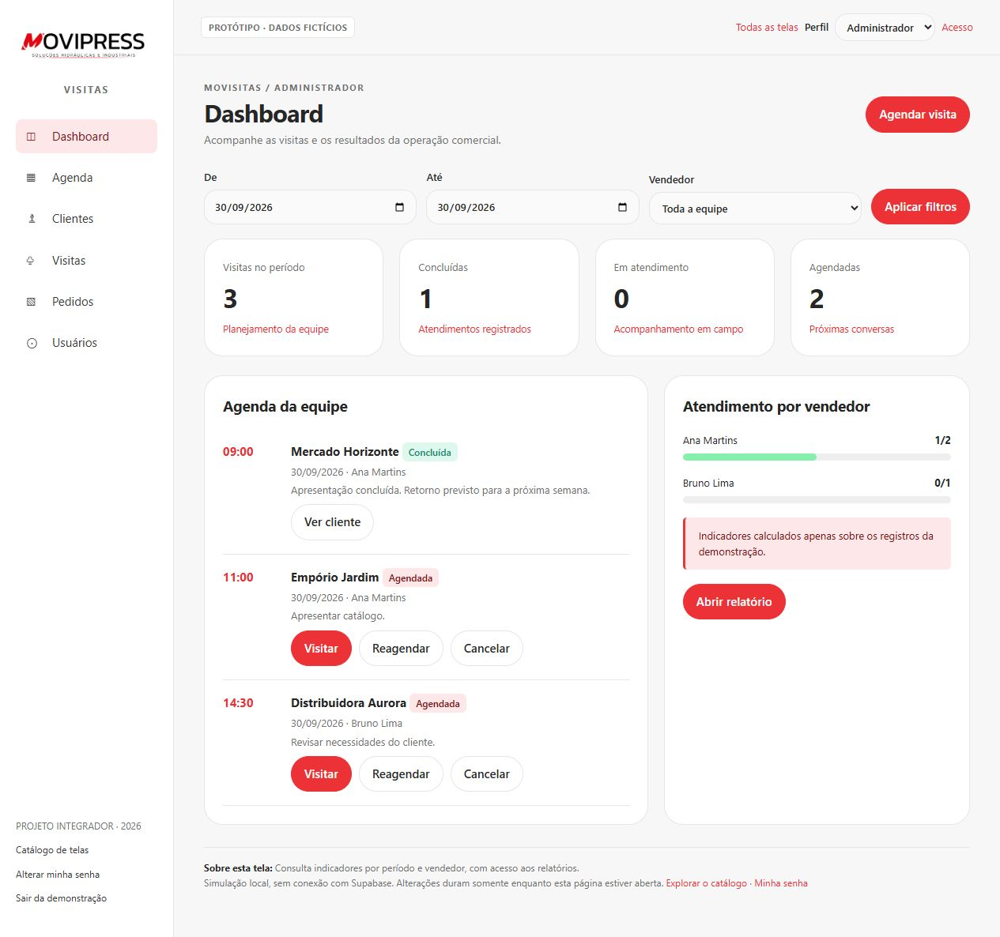
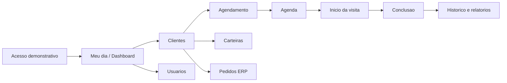

# Prototipação das telas — Movisitas

Entrega de 30/09/2026. Protótipo navegável para discutir a experiência de uso do projeto acadêmico, com **24 telas e fluxos**, resumos funcionais e capturas para o relatório.

## Referência visual

Referência: [aplicação publicada](https://visitas-6ev.pages.dev/), consultada em 30/09/2026. Preservados o vermelho principal `#ED3237`, cinza `#383838`, fundo `#F7F7F8`, superfícies brancas e destaque rosa `#FDE7E8`. Agenda, Vendas, Clientes e Visitas foram observadas no perfil vendedor. As demais telas usam as funcionalidades do código de origem como referência; são adaptações documentais, não cópias exatas.

Todos os nomes, contatos, endereços, valores e pedidos apresentados são fictícios. Nenhum registro ou captura do ambiente de produção integra esta entrega.

## Como abrir

1. Baixe esta pasta inteira ou o repositório e extraia os arquivos.
2. Abra `index.html` no Chrome, Edge ou outro navegador moderno. Mantenha `app.js` e `style.css` na mesma pasta.
3. Use “Todas as telas” para explorar o catálogo e o seletor de perfil para alternar entre administrador, gestor e vendedor.

O GitHub mostra o código HTML, não executa o protótipo na página do arquivo. Para consultar sem executar, use a [galeria das 24 telas](GALERIA.md).

Não há instalação, conexão com Supabase, chave de API ou envio de dados. Os registros são fictícios e ficam somente na memória da página. Recarregar restaura os exemplos. A data-base é fixa em **30/09/2026** para facilitar a reprodução das telas.

## Resumo de cada funcionalidade

| ID | Tela/fluxo | Resumo |
| --- | --- | --- |
| T00 | [Catálogo de telas](index.html#catalog) | Navegação e índice das telas; proposta de apresentação acadêmica. |
| T01 | [Minhas vendas](index.html#sales) | Agrupa pedidos fictícios por cliente, com filtro de mês e ano; referência à tela publicada Vendas. |
| T02 | [Acesso ao Movisitas](index.html#login) | Representa login por e-mail e senha; o perfil é escolhido apenas para simular a experiência. |
| T03 | [Recuperar acesso](index.html#recovery) | Simula solicitação de recuperação; nenhum e-mail é enviado. Proposta, não identificada no login da origem. |
| T04 | [Dashboard](index.html#dashboard) | Consulta indicadores por período e vendedor, com acesso aos relatórios. |
| T05 | [Meu dia](index.html#day) | Reúne progresso diário, agenda e pendências do vendedor. |
| T06 | [Agenda de visitas](index.html#agenda) | Filtra compromissos e permite agendar, reagendar, iniciar ou cancelar. |
| T07 | [Agendar visita](index.html#schedule) | Cria ou altera um agendamento com cliente, vendedor, data, hora e observações. |
| T08 | [Clientes](index.html#clients) | Consulta por nome, cidade e cobertura de atendimento; dá acesso ao cadastro e às ações. |
| T09 | [Detalhes do cliente](index.html#client) | Consolida cadastro, visitas e acesso aos pedidos; composição proposta a partir de ações da origem. |
| T10 | [Cadastro de cliente](index.html#client-form) | Inclui ou edita dados cadastrais, contato, endereço, código ERP e site; simula consultas CEP/CNPJ. |
| T11 | [Carteiras comerciais](index.html#portfolios) | Representa agrupamento e transferência administrativa; tela dedicada proposta para ações presentes na origem. |
| T12 | [Transferir cliente](index.html#transfer) | Simula a transferência para outra carteira, exclusiva do administrador. |
| T13 | [Equipe comercial](index.html#sellers) | Apresentação dedicada de vendedores e suas carteiras; proposta baseada nos dados da origem. |
| T14 | [Visitas](index.html#visits) | Consulta estados, responsáveis, datas e observações dos atendimentos. |
| T15 | [Iniciar atendimento](index.html#checkin) | Simula início da visita, horário e localização opcional. |
| T16 | [Concluir atendimento](index.html#checkout) | Exige observações, permite resultado e próxima ação, e encerra a visita simulada. |
| T17 | [Localização e rota](index.html#map) | Esquema ilustrativo do endereço e roteiro textual; não consulta GPS ou serviço de mapas. |
| T18 | [Pedidos e vendas](index.html#orders) | Consulta pedidos por cliente e período; extensão da origem, fora do núcleo inicial de visitas. |
| T19 | [Importar pedidos](index.html#import) | Demonstra prévia, duplicidades e confirmação com lote fictício; não processa arquivos reais. |
| T20 | [Usuários e permissões](index.html#users) | Lista perfis e simula cadastro, edição e ativação de usuários. |
| T21 | [Cadastro de usuário](index.html#user-form) | Simula cadastro e edição por administrador; gestor pode editar apenas vendedores. |
| T22 | [Alterar minha senha](index.html#password) | Simula validação da senha atual e confirmação da nova senha, sem armazená-las. |
| T23 | [Relatório comercial](index.html#reports) | Filtra dados fictícios e permite imprimir o relatório ou exportar um HTML local. |

Os formulários de cadastro e edição compartilham a mesma tela; agendamento e reagendamento também. Por isso o total inclui rotas e fluxos, não apenas páginas distintas da aplicação original. O catálogo é T00; o protótipo contém 23 telas de produto/apresentação adicionais.

## Jornadas para apresentação

### Vendedor

1. Abra Acesso e escolha Vendedor; use os dados demonstrativos preenchidos.
2. Consulte Agenda e Minhas vendas.
3. Clique em Visitar no compromisso com Empório Jardim.
4. Simule localização disponível ou indisponível e confirme o início.
5. Informe as observações e conclua a visita.
6. Consulte o registro concluído no Histórico de visitas.

### Administrador

1. Selecione Administrador e consulte a Visão comercial.
2. Abra Clientes, cadastre um exemplo e veja seus detalhes.
3. Transfira o cliente para a carteira de outro vendedor, informando um motivo.
4. Cadastre ou edite um usuário na área Usuários.
5. Abra Importar pedidos, confirme o lote fictício e confira a prevenção de repetição.
6. Gere um relatório HTML ou use Imprimir / salvar PDF.

### Gestor

1. Selecione Gestor e consulte os indicadores e a equipe.
2. Consulte carteiras e acompanhe a agenda.
3. Cadastre ou edite apenas vendedores; a transferência de carteiras e a importação administrativa não estão disponíveis nesse perfil.

## Escopo e simplificações

- Layout proposto, inspirado nas funções da origem; não é reprodução pixel a pixel do Flutter.
- Formulários e diálogos da aplicação foram transformados em rotas para facilitar apresentação e revisão.
- Recuperação de acesso é proposta complementar. Cadastro/gestão de usuários permanece uma simulação; não há autenticação real.
- A visualização de mapas é um desenho esquemático; não mede distância nem abre uma rota real. CEP e CNPJ preenchem exemplos locais.
- Importação usa um lote fictício previamente definido, não interpreta um arquivo do ERP. Pedidos são extensão da origem, fora do núcleo funcional inicial.
- “Lembrar acesso” é ilustrativo; nada é persistido. A senha atual de demonstração é `demo123`.
- A demonstração de carteiras usa um responsável por cliente; o esquema existente permite múltiplas associações, decisão pendente no projeto.
- Os filtros de cobertura usam categorias de exemplo; não são uma análise histórica completa. Tabelas possuem rolagem horizontal em telas estreitas.
- O lembrete de próximo contato não cria agendamento automaticamente.
- O seletor de perfil e os bloqueios de navegação são recursos didáticos, não controles de segurança. As políticas RLS precisam ser validadas na implementação.
- Offline, anexos, notificações e domínio próprio permanecem fora desta entrega por serem evoluções futuras da origem.

## Rastreabilidade

Base consultada: projeto Visitas, commit `9abc65a63c4d0bfde67d5550f8ac74b121d9f63a`, arquivos `lib/app.dart`, `lib/features/auth/login_page.dart`, `lib/data/supabase_repository.dart` e README. Consulte [fontes por tela](FONTES.md).

Esta branch parte de `codex/mapa-mental-ideacao`, preservando o mapa mental da entrega anterior ainda não integrado à main. A prototipação é uma entrega documental complementar; não substitui a fase 3 de implementação Flutter nem significa que o banco foi implantado.

## Validação realizada

- As 24 rotas foram abertas e capturadas no navegador.
- Filtros de cobertura de clientes e mês de vendas conferidos, incluindo resultado vazio.
- Agenda móvel no perfil vendedor conferida em 390 × 844, sem transbordamento horizontal.
- Nenhum erro registrado no console durante esta revisão.

Evidência em [VALIDACAO.json](VALIDACAO.json). Esta revisão não inclui testes de integração com banco, auditoria de segurança ou avaliação com usuários.

## Arquivos

- `index.html`, `style.css`, `app.js`: protótipo executável localmente.
- `GALERIA.md` e `telas/`: capturas das 24 telas e resumo de cada uma.
- `preview-desktop.png`, `preview-mobile.png`: imagens gerais para consulta e relatório.
- `FONTES.md`: correspondência com a aplicação existente e propostas.

Fonte das telas e capturas: elaboração para o projeto Movisitas (2026). Dados fictícios; nenhum resultado de entrevistas ou validação em campo é afirmado por este material.
